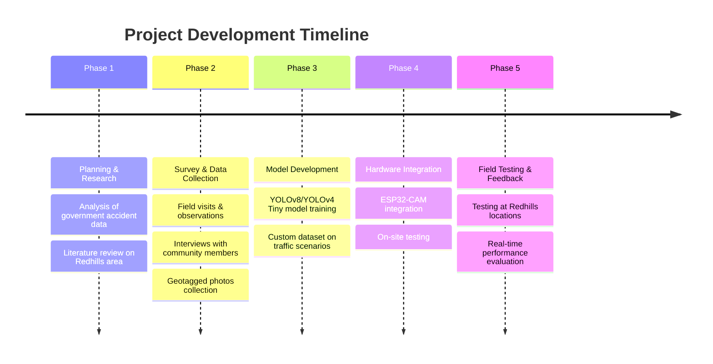

<div align="center">

# 🚦Traffic Collision and Accident Prevention Detection using Deep Learning & IOT

### *A Real-Time AI-Powered Road Safety System for Community Welfare*


> 🚀 **This project is titled **"Traffic Collision and Accident Prevention Detection Using Deep Learning (Community Services)"** and focuses on addressing the critical issue of road accidents, particularly on highways, using a deep learning-based system.**


</div>

---

## 📋 Table of Contents

- [📌 Abstract](#-abstract)
- [🎯 Objectives](#-objectives)
- [🔴 Problem Statement](#-problem-statement)
- [✅ Solution & Approach](#-solution--approach)
- [🔧 How the Project Works](#-how-the-project-works)
- [📋 Project Pseudocode](#-project-pseudocode)
- [📐 Project Flowchart](#-project-flowchart)
- [🌐 IoT Hardware Upgrade](#-iot-hardware-upgrade--from-software-to-smart-edge-device)
- [💡 Impact](#-impact)
- [🛠️ Technology Stack](#️-technology-stack)
- [📦 Libraries & Dependencies](#-libraries--dependencies)
- [📁 Project Structure](#-project-structure)
- [🗺️ System Architecture & Block Diagram](#️-system-architecture--block-diagram)
- [👥 Survey & Community Engagement](#-survey--community-engagement)
- [📝 Survey Questions](#-survey-questions)
- [📊 Survey Analysis](#-survey-analysis)
- [🔁 Project Phases](#-project-phases)
- [💻 Main Program](#-main-program)
- [🔍 Code Analysis](#-code-analysis)
- [🚀 Installation & Usage](#-installation--usage)
- [📁 Project Files](#-project-files)
- [🔏 Official Permission & Bona Fide](#-official-permission--bona-fide)
- [🌟 Scope of Future Implementation](#-scope-of-future-implementation)
- [🤝 Open Source Contribution](#-open-source-contribution)
- [👨‍💻 Team Members & Author](#-team-members--author)
- [🙏 Acknowledgements](#-acknowledgements)
- [📄 License](#-license)
- [📚 References](#-references)

---

## 📌 Abstract

This project is titled **"Traffic Collision and Accident Prevention Detection Using Deep Learning for Community Services"** and focuses on addressing the critical issue of road accidents, particularly on highways, using a deep learning-based system.

A custom **Convolutional Neural Network (CNN) / YOLOv8** model processes video streams in real time, achieving high accuracy in object detection through feature extraction and classification. The system detects vehicles and pedestrians using bounding boxes, calculates vehicle speed, and estimates the distance between objects using the **Euclidean distance formula**. If a high-speed vehicle approaches a potential collision, the system triggers an alert for timely intervention.

Visual feedback including bounding boxes and speed indicators enhances the system's effectiveness. The project ensures **real-time processing, high accuracy, and scalability** — providing an innovative and efficient method for improving road safety and community welfare.

> [*click to view Abstract of the Project*](https://drive.google.com/file/d/1T6qck_z0f7EHBrOzNwW9Iln4F77Cx6G1/view?usp=sharing)
---

## 🎯 Objectives

- ✅ **Detect vehicles and pedestrians in real-time** using YOLOv8 deep learning model
- ✅ **Calculate proximity** between detected objects using the Euclidean distance formula
- ✅ **Trigger collision warnings** automatically when threshold distance is breached
- ✅ **Deploy IoT hardware** (ESP32-CAM + GPS + Wi-Fi) for real-world highway deployment
- ✅ **Alert emergency services** with GPS-tagged location when collision risk is detected
- ✅ **Conduct community survey** at Redhills, Chennai to validate real-world impact
- ✅ **Scale to smart city** traffic management infrastructure in future phases

---

## 🔴 Problem Statement

Road traffic accidents are one of the most pressing and persistent social challenges faced globally and particularly in developing countries like **India**.

- 🇮🇳 India alone witnesses more than **400 deaths per day** due to road crashes, according to national reports.
- According to the **World Health Organization (WHO)**, road traffic injuries are the leading cause of death among individuals aged **5–29 years**, with over **1.3 million fatalities annually**.
- Areas like **Redhills**, a critical junction connecting Chennai with northern districts of Tamil Nadu, face unique challenges due to:
  - Heavy traffic congestion on NH-16, NH-716, and the Outer Ring Road (ORR)
  - Poorly monitored intersections
  - Insufficient traffic management systems
  - Lack of real-time hazard alerts
  - Delayed emergency response times
  - Reliance solely on manual physical patrolling & CCTV without AI integration

> **"Traditional accident detection systems in Redhills are limited to physical patrolling, CCTV surveillance with no AI integration, and public reporting — resulting in delayed awareness, prolonged emergency response times, and a lack of real-time data collection."**

This initiative also aligns with **United Nations SDG 11 – Sustainable Cities and Communities**, emphasizing the role of smart technologies in urban safety and resilience.

---

## ✅ Solution & Approach

The proposed solution is a **real-time AI-based Traffic Collision and Accident Prevention Alert System** that uses:

1. **YOLOv8 (You Only Look Once) Deep Learning Model** — detects vehicles and pedestrians in video frames with high accuracy.
2. **Euclidean Distance Calculation** — estimates proximity between detected objects to predict potential collisions.
3. **Real-Time Alert System** — triggers visual alerts (bounding boxes + warning text on screen) when a collision risk is detected.
4. **ESP32-CAM Microcontroller** — enables edge processing for embedded deployment on highways.
5. **GPS Module** — provides precise location tracking of accident zones.
6. **Wi-Fi Communication** — enables instant alert transmission to traffic police and emergency responders.

### How It Works

```
Video Input (Camera/Video File)
        ↓
YOLOv8 Object Detection
        ↓
Identify Vehicles & Pedestrians
        ↓
Calculate Euclidean Distance Between Objects
        ↓
Distance < Threshold? → ⚠️ Collision Warning Triggered
        ↓
Alert Emergency Services / Traffic Police
```

---

## 🔧 How the Project Works

The system works by continuously processing a live video stream to detect vehicles and pedestrians, calculating the risk of collision in real time, and triggering alerts when danger is imminent.

### Step-by-Step Working

#### Step 1 — Video Input Capture
The system captures a **live video stream** from:
- A connected **webcam** or **IP camera** mounted at a traffic location
- A **pre-recorded traffic video file** for testing
- An **ESP32-CAM module** for embedded edge deployment on highways

Each frame is processed sequentially in real time using **OpenCV**.

📺 *Resource:* [OpenCV Video Capture Tutorial](https://www.youtube.com/watch?v=uWP6UjDeZvY&t=39)

#### Step 2 — Detect Vehicles with YOLOv8
Each video frame is passed through the **YOLOv8** model:
- Performs **object classification and localization** in a single forward pass
- Produces **bounding boxes** `(x1, y1, x2, y2)` around each detected vehicle
- Only keeps detections with confidence ≥ **0.4 (40%)**
- Vehicle classes detected: `Car (2)`, `Motorcycle (3)`, `Bus (5)`, `Truck (7)`

📺 *Resource:* [Vehicle Detection with YOLOv8](https://www.youtube.com/watch?v=uWP6UjDeZvY&t=39)

#### Step 3 — Detect Pedestrians with YOLOv8
Using the same YOLOv8 model, pedestrians (`class 0 = person`) are identified in the frame with their bounding boxes.

📺 *Resource:* [Pedestrian Detection with YOLOv8 + DeepSORT](https://www.youtube.com/watch?v=jIRRuGN0j5E)

#### Step 4 — Filter Detections by ROI (Region of Interest)
Detections are filtered to only those **within the defined ROI** — the specific zone of the road where collision detection is relevant (e.g., a pedestrian crossing or highway merge point).

📺 *Resource:* [People Counting in ROI with OpenCV](https://www.youtube.com/watch?v=t61EqN8ZwDQ)
📺 *Resource:* [Retail Counter / ROI Zone Tutorial](https://www.youtube.com/watch?v=hAWpsIuem10&t=1519s)

#### Step 5 — Calculate Distance Between Bounding Boxes
For every vehicle–pedestrian pair detected in the ROI, the **Euclidean distance** between their bounding box centers is calculated:

```
distance = √((cx₂ - cx₁)² + (cy₂ - cy₁)²)
```

where `(cx, cy)` is the center point of each bounding box.

📺 *Resource:* [Distance Calculation with Ultralytics YOLOv8](https://www.youtube.com/watch?v=LE8am1QoVn4)

#### Step 6 — Collision Warning Triggered
If `distance < THRESHOLD (100 pixels)`, a collision risk is flagged:
- ⚠️ **Warning text** is overlaid on the video frame
- Both at-risk objects are highlighted with **red bounding boxes**
- *(IoT upgrade)* **Buzzer** sounds at the roadside unit
- *(IoT upgrade)* **Wi-Fi alert** is transmitted via ESP32 to the police portal
- *(IoT upgrade)* **GPS coordinates** of the incident are included in the alert

#### Step 7 — Draw Bounding Boxes & Display
- **Blue boxes** — Safe vehicles
- **Green boxes** — Pedestrians (safe)
- **Red boxes + ⚠️ text** — Collision risk pair
- The annotated frame is displayed in real time via OpenCV window

#### Step 8 — Exit & Resource Release
The loop continues until the video ends or the user presses `Q`. Resources are then released:
```python
cap.release()
cv2.destroyAllWindows()
```

---

## 📋 Project Pseudocode


```
START

IMPORT necessary libraries (OpenCV, YOLOv8)

LOAD YOLOv8 models for vehicles and pedestrians

INITIALIZE video capture

DEFINE ROI (Region of Interest) coordinates

WHILE video is open:
    CAPTURE current frame

    DETECT vehicles using YOLOv8
        # Tutorial: https://www.youtube.com/watch?v=uWP6UjDeZvY&t=39

    DETECT pedestrians using YOLOv8
        # Tutorial: https://www.youtube.com/watch?v=jIRRuGN0j5E

    FILTER vehicle and pedestrian detections based on ROI
        # Tutorial: https://www.youtube.com/watch?v=t61EqN8ZwDQ

    FOR each vehicle in detected vehicles:
        FOR each pedestrian in detected pedestrians:

            CALCULATE distance between vehicle and pedestrian bounding boxes
                # Tutorial: https://www.youtube.com/watch?v=LE8am1QoVn4

            IF distance < threshold THEN
                TRIGGER collision warning
                # [IoT] Activate Buzzer + LED
                # [IoT] Send Wi-Fi alert via ESP32 with GPS location
            ENDIF

        ENDFOR
    ENDFOR

    DRAW bounding boxes for vehicles (blue) and pedestrians (green)
    IF collision warning THEN
        DISPLAY warning alert on frame (red boxes + text)
    ENDIF

    DISPLAY processed frame

    CHECK for exit condition (e.g., 'q' key)
ENDWHILE

RELEASE video capture
DESTROY all OpenCV windows

END
```

---

## 📐 Project Flowchart

```
┌─────────────────────────────────────┐
│              START                  │
└────────────────┬────────────────────┘
                 │
                 ▼
┌─────────────────────────────────────┐
│  Import Libraries (OpenCV, YOLOv8)  │
└────────────────┬────────────────────┘
                 │
                 ▼
┌─────────────────────────────────────┐
│  Load YOLOv8 Models                 │
│  (Vehicles + Pedestrians)           │
└────────────────┬────────────────────┘
                 │
                 ▼
┌─────────────────────────────────────┐
│  Initialize Video Capture           │
│  Define ROI Coordinates             │
└────────────────┬────────────────────┘
                 │
                 ▼
┌─────────────────────────────────────┐
│         Video is Open?              │
└───┬─────────────────────────────┬───┘
   YES                            NO → END
    │
    ▼
┌─────────────────────────────────────┐
│  Capture Current Frame              │
└────────────────┬────────────────────┘
                 │
        ┌────────┴────────┐
        ▼                 ▼
┌───────────────┐  ┌───────────────────┐
│ Detect        │  │  Detect           │
│ Vehicles      │  │  Pedestrians      │
│ (YOLOv8)      │  │  (YOLOv8)         │
└───────┬───────┘  └────────┬──────────┘
        └────────┬───────────┘
                 │
                 ▼
┌─────────────────────────────────────┐
│  Filter Detections by ROI           │
└────────────────┬────────────────────┘
                 │
                 ▼
┌─────────────────────────────────────┐
│  For Each Vehicle + Pedestrian Pair │
│  → Calculate Euclidean Distance     │
│    d = √((cx₂-cx₁)²+(cy₂-cy₁)²)   │
└────────────────┬────────────────────┘
                 │
         ┌───────┴──────────┐
         ▼                  ▼
   distance < 100px    distance ≥ 100px
         │                  │
         ▼                  ▼
┌─────────────────┐  ┌──────────────────┐
│ ⚠️ COLLISION    │  │  Draw Normal     │
│ WARNING!        │  │  Bounding Boxes  │
│ Red Boxes +     │  │  Blue = Vehicle  │
│ Alert Text      │  │  Green = Person  │
└────────┬────────┘  └────────┬─────────┘
         │                    │
         ▼                    │
┌─────────────────────────────────────┐
│ [IoT] Buzzer + LED Trigger          │
│ [IoT] ESP32 Wi-Fi → Alert + GPS     │
│       → Traffic Police Portal       │
└────────────────┬────────────────────┘
                 │◄───────────────────┘
                 ▼
┌─────────────────────────────────────┐
│  Display Processed Frame            │
└────────────────┬────────────────────┘
                 │
         ┌───────┴──────────┐
         ▼                  ▼
   Press 'Q' ?         More Frames?
         │                  │
         ▼                  ▼
┌──────────────┐      Back to Loop↑
│     END      │
│ cap.release()│
│ destroyAll() │
└──────────────┘
```


### Flowchart Step Explanations

| Step | Description | Resource |
|------|-------------|----------|
| **Start** | Initiates the program | — |
| **Import Libraries** | Loads OpenCV and YOLOv8 | [YOLOv8 Docs](https://docs.ultralytics.com) |
| **Load YOLOv8 Models** | Loads vehicle + pedestrian detection models | [YOLOv8 Tutorial](https://www.youtube.com/watch?v=uWP6UjDeZvY&t=39) |
| **Initialize Video Capture** | Sets up video feed from camera / file / ESP32-CAM | [OpenCV Capture](https://docs.opencv.org) |
| **Define ROI** | Specifies the detection zone on the road | [ROI Tutorial](https://www.youtube.com/watch?v=t61EqN8ZwDQ) |
| **Detect Vehicles** | YOLOv8 identifies vehicles in the ROI | [Vehicle Detection](https://www.youtube.com/watch?v=uWP6UjDeZvY&t=39) |
| **Detect Pedestrians** | YOLOv8 identifies pedestrians in the ROI | [Pedestrian Detection](https://www.youtube.com/watch?v=jIRRuGN0j5E) |
| **Filter by ROI** | Removes detections outside the defined zone | [Filtering Detections](https://www.youtube.com/watch?v=t61EqN8ZwDQ) |
| **Calculate Distance** | Euclidean distance between each vehicle-pedestrian pair | [Distance Calculation](https://www.youtube.com/watch?v=LE8am1QoVn4) |
| **Collision Check** | If distance < threshold → collision risk | — |
| **Trigger Warning** | Red boxes + alert text + IoT buzzer/Wi-Fi/GPS | — |
| **Display Frame** | Shows annotated frame in OpenCV window | — |
| **Exit** | Release capture, destroy OpenCV windows | — |

---

## 🌐 IoT Hardware Upgrade — From Software to Smart Edge Device

The base project concept (from the reference article) was implemented as a **Python-based software system** running on a laptop or PC. This project **upgraded it with full IoT integration** to enable real-world deployment at Redhills highway intersections.

### 🔄 Original Software vs. Our IoT-Upgraded System

| Feature | Original Software System | Our IoT-Upgraded System |
|---------|--------------------------|-------------------------|
| **Processing Device** | Laptop / PC | ESP32-CAM (Edge Device) |
| **Camera Input** | Webcam / Video File | ESP32-CAM Built-in Camera |
| **Alert Output** | Screen warning (OpenCV only) | Screen + Buzzer + LED + Wi-Fi |
| **Location Tracking** | ❌ None | ✅ GPS Module (Neo-6M) |
| **Network Connectivity** | ❌ Local only | ✅ Wi-Fi (ESP32 built-in) |
| **Emergency Notification** | ❌ Manual observation | ✅ Auto-alert to Traffic Police |
| **Power Source** | Mains power (laptop) | Battery-powered (portable) |
| **Deployment Location** | Indoor / Lab only | Outdoor Highway / Junction |

---

### 🔌 IoT Hardware Components

| Component | Model | Function |
|-----------|-------|----------|
| **Microcontroller** | ESP32-CAM | Edge AI + Wi-Fi + Camera in one module |
| **Camera** | OV2640 (on ESP32-CAM) | Captures live traffic video feed |
| **GPS Module** | Neo-6M / u-blox | Real-time location tracking |
| **Buzzer** | Active Buzzer | Audible alert when collision detected |
| **LED Indicator** | Red LED | Visual alert at the roadside unit |
| **Wi-Fi** | Built-in (ESP32) | Sends alert + GPS to police portal |
| **Power Supply** | 5V Li-ion Battery | Self-contained, portable deployment |

---

### 📡 IoT Alert Flow

```
[ESP32-CAM captures live video]
          │
          ▼
[YOLOv8 + Euclidean Distance on PC/Cloud]
          │  Collision Detected!
          ▼
[Collision Signal → ESP32 via Wi-Fi]
          │
          ├──→ 🔊 Buzzer / 🔴 LED — Instant roadside alert
          │
          ├──→ 📍 GPS Module reads coordinates
          │         Lat: xx.xxxx  |  Long: xx.xxxx
          │
          └──→ 📡 Wi-Fi transmits ALERT + GPS to:
                    → Traffic Police Portal
                    → Emergency Control Room
                    → Mobile Notification
```

---

### 🛠️ ESP32-CAM Wiring & Setup

```
ESP32-CAM       →   Power Supply
   5V           →   VCC
   GND          →   GND
   GPIO12       →   Buzzer (+)
   GPIO13       →   LED (+)

GPS Module (Neo-6M)  →  ESP32
   TX    →  RX (GPIO3)
   RX    →  TX (GPIO1)
   VCC   →  3.3V
   GND   →  GND
```

#### Arduino IDE Libraries for ESP32
```bash
# Install these in Arduino IDE Board Manager / Library Manager:
# - ESP32 Board Package (by Espressif)
# - TinyGPS++ (GPS data parsing)
# - WiFi.h (built-in with ESP32)
# - HTTPClient.h (for sending HTTP alerts)
```

---


## 💡 Impact

| Beneficiary | Impact |
|-------------|--------|
| 🚗 Drivers & Passengers | Real-time collision warnings reduce accident risk |
| 🚶 Pedestrians | Alerts protect pedestrians near high-speed zones |
| 🚑 Emergency Medical Teams | Accurate GPS-based location alerts for swift response |
| 👮 Traffic Police | Automated monitoring reduces dependence on manual patrolling |
| 🏘️ Remote/Rural Communities | Affordable, scalable system for accident-prone highways |
| 🏙️ Smart Cities | Data for traffic analysis and identifying high-risk zones |

**Envisioned Long-Term Impact:**
- Potential to save **thousands of lives annually**, especially in rural and highway settings where human surveillance is minimal.
- Collected data can be used for traffic analysis and identifying high-risk zones.
- Serves as a **model for semi-urban and suburban areas** across India.
- Contributes to **SDG 11: Sustainable Cities and Communities**.

---

## 🛠️ Technology Stack

### Software & AI/ML

| Technology | Version | Purpose |
|-----------|---------|----------|
| **Python** | 3.8+ | Core programming language |
| **YOLOv8 (Ultralytics)** | Latest | Real-time object detection model |
| **OpenCV (cv2)** | ≥4.5.0 | Video capture, frame processing & visualization |
| **NumPy** | ≥1.21.0 | Mathematical computations |
| **Math (Euclidean)** | Built-in | Distance calculation between detected objects |

### Hardware Components

| Component | Model | Purpose |
|-----------|-------|---------|
| **ESP32-CAM** | AI Thinker | Edge AI microcontroller for on-device processing |
| **Camera Module** | OV2640 | Video feed capture for real-time analysis |
| **GPS Module** | Neo-6M | Precise location tracking of accident zones |
| **Wi-Fi Module** | Built-in (ESP32) | Instant alert transmission to traffic authorities |
| **Buzzer / LED Alerts** | Active Buzzer | Physical alert system at detection point |

### YOLO Classes Detected

| Class ID | Object |
|---------|--------|
| `0` | Person / Pedestrian |
| `2` | Car |
| `3` | Motorcycle |
| `5` | Bus |
| `7` | Truck |

---

## 📦 Libraries & Dependencies

```bash
# Core ML & Computer Vision
pip install ultralytics
pip install opencv-python
pip install numpy

# Optional: for visualization & analysis
pip install matplotlib
pip install pandas
```

**Or install all at once:**
```bash
pip install ultralytics opencv-python numpy matplotlib pandas
```

**Arduino IDE Libraries for ESP32 IoT:**
```bash
# Install in Arduino IDE Board Manager / Library Manager:
# - ESP32 Board Package (by Espressif)
# - TinyGPS++ (GPS data parsing)
# - WiFi.h (built-in with ESP32)
# - HTTPClient.h (for sending HTTP alerts)
```

---

## 📁 Project Structure

```
Traffic-Collision-Detection/
│
├── 📁 models/                            # 🤖 YOLOv8 model files
│   ├── yolov8n.pt                        # YOLOv8 Nano pre-trained weights (download required)
│   ├── yolov8s.pt                        # YOLOv8 Small weights (optional, higher accuracy)
│   └── coco128.yaml                      # COCO dataset config (80 class definitions)
│
├── 📁 data/                              # 📂 COCO class names & configs
│   └── coco.names                        # 80 COCO class labels (person, car, bus, truck...)
│
├── 📁 Survey Photoes/                    # Field survey photographs
│   ├── Survey area Redhills.png
│   ├── Bus Stand.jpg
│   ├── Highway.jpg
│   └── A Geo Tag Group.jpg
│
├── Traffic Collision Alert System        # 🐍 Main Python detection program
│   using Deep learning.py
│
└── README.md                             # 📖 This documentation
```

> ⚠️ **Model Files Not Included**: `yolov8n.pt` and `coco128.yaml` are not committed to this repository due to size. Download them as described in [Installation & Usage](#-installation--usage).

---

## 🗺️ System Architecture & Block Diagram

The system follows an end-to-end pipeline from video capture to alert generation:

```
[Camera / Video Input]
         ↓
[YOLOv8 Deep Learning Model]
    ↙           ↘
[Vehicles]   [Pedestrians]
         ↓
[Bounding Box Extraction]
         ↓
[Euclidean Distance Calculation]
         ↓
[Collision Risk Assessment]
   Threshold < 100 pixels?
         ↓ YES
[⚠️ Visual Alert + Bounding Box Highlight]
         ↓
[Transmit Alert → ESP32 → Wi-Fi → Police/Emergency]
```

> 📌 **Block Diagram:** See `Block Diagram.jpg` in this repository for the complete visual architecture.

---

## 👥 Survey & Community Engagement

To validate the real-world need for this project, our team conducted a comprehensive on-ground survey at **Redhills, Chennai**, a critical accident-prone intersection of:

- 🛣️ **National Highway 16 (NH-16)**
- 🛣️ **National Highway 716 (NH-716)**
- 🛣️ **Outer Ring Road (ORR)**
- 🛣️ **Chennai–Thiruvallur High Road (CTH Road)**

### Survey Activities

| Date | Activity | Outcome |
|------|----------|---------|
| 29/11/24 | Initial project planning & requirement analysis | Identified real-time community problem |
| 30/11/24 | Goal & scope definition finalized | Defined challenges in deep learning-based accident prevention |
| 02/12/24 | Sensor research & hardware component selection | Focused on low-cost CNN-based detection solution |
| 04/12/24 | Prototype development | Converted idea to working flowchart model |
| 06/12/24 | Village analysis & community study | Understood day-to-day challenges from traffic collisions |
| 07/12/24 | Survey & geotagged photos | Collected public opinions; examined accident-prone areas |
| 11/12/24 | Survey analysis | Analyzed data on people facing accidents daily |
| 13/12/24 | Meeting with higher officials (Traffic Police) | Proposed idea and obtained official approval & permission |

### Survey Locations
- 📍 **Redhills Bus Stand** — Interviewed bus drivers about accident incidents
- 📍 **Redhills Highway Area** — Public survey with residents about real-life accident experiences
- 📍 **Redhills Junction** — Geotagged field observations


---


### Survey Google Form
📊 **Survey Excel Analysis:** [View on Google Sheets](https://docs.google.com/spreadsheets/d/1Z7wNAqDuuX8OEwUKVNr_WBi85BpdiTD0RXc-W4SF2e0/edit?usp=sharing)


📱 **Survey QR Code:** 


---

## 📝 Survey Questions

The following questions were asked to Redhills community members, bus drivers, and pedestrians:

1. What do you think are the major causes of traffic accidents in the area of Redhills?
2. How concerned are you about traffic collisions and accidents in your community?
3. Have you ever been involved in or witnessed a traffic accident?
4. How many times did you get involved in a traffic accident? Where? And what type of accident? *(If NO, please type "NA")*
5. Do you believe technology can help reduce traffic collisions and accidents?
6. What do you think about the idea of using a camera and A.I. to detect potential traffic collisions and accidents?
7. Do you follow traffic rules and regulations?
8. Would you participate in road safety awareness programs if organized in your area?
9. Are you aware of traffic collision and accident prevention systems?
10. Do you use safety features like seat belts and helmets regularly?
11. How would you give an overall rating for traffic management in Redhills?
12. How would you give an overall rating for traffic management by police?
13. Did you ever feel traffic congestion near a bus stand or railway station?
14. How useful do you think the real-time alert system (lights, buzzer, notifications) would be in preventing accidents?
15. Do you think road conditions in Chennai need improvement?
16. Do you think traffic signals are working properly and maintained well?
17. Do you think traffic cameras help control traffic?
18. How often do you experience traffic congestion?

[SURVEY QUESTIONS.pdf](https://github.com/user-attachments/files/25466475/SURVEY.QUESTIONS.pdf)


---

## 📊 Survey Analysis

Survey data collected from Redhills community members and bus drivers was analyzed and key findings revealed:

- 📌 **High accident awareness** — Most respondents had witnessed or experienced traffic accidents
- 📌 **Strong technology acceptance** — Majority believed AI/camera-based systems can reduce accidents
- 📌 **Poor traffic signal maintenance** — Community reported inadequate traffic signal functioning
- 📌 **Need for improvement** — Road conditions and traffic management rated low by residents
- 📌 **Safety equipment** — Mixed compliance with seat belts and helmets
- 📌 **Congestion hotspots** — Bus stands and highway intersections identified as major congestion points


---

## 🔁 Project Phases

The project followed a structured milestone-based development approach:



---

## 💻 Main Program

**File:** [`Traffic Collision Alert System using Deep learning.py`](./Traffic%20Collision%20Alert%20System%20using%20Deep%20learning.py)

```python
import cv2
import numpy as np
from ultralytics import YOLO
import math

# Load YOLOv8 model
model = YOLO('yolov8n.pt')  # Use yolov8n.pt or yolov8s.pt

# Classes: 0 = person, 2-7 = vehicles (car, motorcycle, bus, truck)
VEHICLE_CLASSES = [2, 3, 5, 7]
PERSON_CLASS = 0
DISTANCE_THRESHOLD = 100  # Pixel distance for collision warning

# Video capture
cap = cv2.VideoCapture("input_video.mp4")  # Replace with 0 for webcam

def calculate_distance(box1, box2):
    x1, y1 = int((box1[0] + box1[2]) / 2), int((box1[1] + box1[3]) / 2)
    x2, y2 = int((box2[0] + box2[2]) / 2), int((box2[1] + box2[3]) / 2)
    return math.sqrt((x2 - x1)**2 + (y2 - y1)**2)
```

**Key Features of the Program:**
- Loads pretrained **YOLOv8** model for object detection
- Detects vehicles (cars, trucks, buses, motorcycles) and pedestrians from video
- Calculates **Euclidean distance** between each vehicle–pedestrian pair
- Triggers **⚠️ Collision Warning** on screen when distance < threshold (100 pixels)
- Highlights objects with **color-coded bounding boxes** (Red = collision risk, Blue = vehicle, Green = person)
- Supports both **video file input** and **live webcam feed**

---

## 🔍 Code Analysis

### Design Decisions

| Decision | Rationale |
|----------|-----------|
| **YOLOv8 over older YOLO versions** | YOLOv8 provides significantly better mAP and speed for real-time detection |
| **Euclidean Distance over IoU** | Simpler to compute per-frame; sufficient for proximity-based collision risk in this use case |
| **ROI Filtering** | Limits detection to the accident-prone zone, reducing false positives from irrelevant objects |
| **100-pixel threshold** | Calibrated for typical camera distances at intersections; adjustable per deployment |
| **ESP32-CAM for edge deployment** | Low-cost (<$10), built-in camera + Wi-Fi, battery operable — ideal for highway installations |
| **GPS Neo-6M module** | Wide availability, low cost, and compatible UART interface with ESP32 |
| **Confidence ≥ 0.4** | Balances detection recall vs. false positives — reduces noise without missing real hazards |
| **Color-coded bounding boxes** | Instant visual feedback for human operators monitoring video feeds |

### Algorithm Complexity

| Operation | Complexity | Notes |
|-----------|-----------|-------|
| YOLOv8 Inference | O(1) per frame | Fixed model size; GPU-accelerated |
| Euclidean Distance | O(V × P) | V = vehicles, P = pedestrians per frame |
| ROI Filtering | O(N) | N = total detections per frame |
| Total per frame | ~O(V × P) | Typically very small N, negligible overhead |

### Script Dependency Map

```
Video Input (Camera / File / ESP32-CAM)
         ↓
OpenCV VideoCapture → Frame extraction
         ↓
YOLOv8 Model → Vehicle + Pedestrian detection
         ↓
ROI Filter → Remove out-of-zone detections
         ↓
Euclidean Distance → Per pair calculation
         ↓
Threshold Check → Collision warning trigger
         ↓
[IoT] ESP32 Wi-Fi → GPS Alert to Police Portal
```

---

## 🚀 Installation & Usage

### Prerequisites

```bash
pip install ultralytics opencv-python numpy
```

### Run the Detection System

```bash
# Clone this repository
git clone https://github.com/your-username/traffic-collision-detection.git
cd traffic-collision-detection

# Install dependencies
pip install ultralytics opencv-python numpy

# Run with a video file
python "Traffic Collision Alert System using Deep learning.py"

# To use webcam instead of video file, change line 15 in the script:
# cap = cv2.VideoCapture(0)  # 0 for default webcam
```

### Controls

| Key | Action |
|-----|--------|
| `Q` | Quit the detection window |

### Output

- Real-time video window: **"Traffic Collision Detection"**
- **Blue boxes** = Detected vehicles
- **Green boxes** = Detected pedestrians
- **Red boxes + ⚠️ Warning text** = Collision risk detected

---

## 📁 Project Files

| File / Folder | Description |
|---------------|-------------|
| `Traffic Collision Alert System using Deep learning.py` | 🐍 Main Python deep learning detection program |
| `models/yolov8n.pt` | 🤖 YOLOv8 Nano pre-trained weights — **download required** (see below) |
| `models/yolov8s.pt` | 🤖 YOLOv8 Small weights (optional — higher accuracy, slower) |
| `models/coco128.yaml` | ⚙️ COCO dataset configuration file with 80 class definitions |
| `data/coco.names` | 📋 COCO class label list (person, car, bus, motorcycle, truck…) |


### 📥 Downloading YOLOv8 Weights & COCO Files

```bash
# YOLOv8 weights are auto-downloaded by Ultralytics on first run:
python -c "from ultralytics import YOLO; YOLO('yolov8n.pt')"

# Or download manually:
# yolov8n.pt  → https://github.com/ultralytics/assets/releases/download/v0.0.0/yolov8n.pt
# yolov8s.pt  → https://github.com/ultralytics/assets/releases/download/v0.0.0/yolov8s.pt
# coco128.yaml → included with ultralytics package (ultralytics/cfg/datasets/coco128.yaml)

# Download coco.names (80 class labels):
# https://github.com/pjreddie/darknet/blob/master/data/coco.names
```

| Model | Size | mAP (val) | Speed | Best For |
|-------|------|-----------|-------|----------|
| `yolov8n.pt` | 6.3 MB | 37.3 | Fastest | Edge / ESP32-CAM |
| `yolov8s.pt` | 21.5 MB | 44.9 | Fast | PC / Laptop |
| `yolov8m.pt` | 49.7 MB | 50.2 | Medium | High accuracy |
| `yolov8l.pt` | 83.7 MB | 52.9 | Slower | GPU server |

---

## 🔏 Official Permission & Bona Fide

This project has received **official permission and bona fide certification** from:

> **M4 – Redhills Traffic Police Community**
> Sub Inspector of Police, Redhills Traffic Station

The certificate confirms the authenticity of the community service survey conducted by the project team at Redhills, Chennai.
 


---

## Working Demo Prototype Video


https://github.com/user-attachments/assets/ad80b8ec-d7af-4390-a48b-230e59c57a65


---
## 🌟 Scope of Future Implementation

As a **Minor Project** extension, this system can be enhanced with:

| Feature | Description |
|---------|-------------|
| 🏙️ **Smart City Integration** | Connect with traffic signals, surveillance systems, and urban control centers |
| ⚡ **Edge AI & IoT Devices** | Use low-power edge devices (NVIDIA Jetson Nano, Seeed XIAO ESP32S3) |
| 🚗 **V2I Communication** | Vehicle-to-Infrastructure direct communication for real-time hazard alerts |
| 🤖 **Advanced Deep Learning** | 3D object detection, LiDAR, and self-supervised learning for better accuracy |
| 📱 **Mobile App Integration** | App for alerts, user reports, and community feedback |
| ☁️ **Cloud-Based Dashboard** | Monitor traffic trends, accident hotspots, and AI-generated safety recommendations |

---

## 🤝 Open Source Contribution

We warmly welcome contributions from the open source community! Whether it's **bug fixes**, **new models**, **UI improvements**, or **documentation** — every contribution helps!

### How to Contribute

```bash
# 1. Fork the repository on GitHub
# 2. Clone your fork
git clone https://github.com/ArokiyaNithish/traffic-collision-detection.git
cd traffic-collision-detection

# 3. Create a feature branch
git checkout -b feature/your-feature-name

# 4. Make changes and commit
git add .
git commit -m "feat: improve collision threshold calibration"

# 5. Push to your fork
git push origin feature/your-feature-name

# 6. Open a Pull Request on GitHub → main branch
```

### Contribution Areas

| Area | Good First Issue? | Description |
|------|------------------|-------------|
| 🐛 **Bug Fixes** | ✅ Yes | Fix hardcoded paths, edge cases in detection |
| 📊 **New Models** | ✅ Yes | Add YOLOv9 / YOLOv10 comparison |
| 🌐 **UI Improvement** | ✅ Yes | Web dashboard for live alerts |
| 📉 **Visualization** | ✅ Yes | Add detection heatmaps, trajectory plots |
| 🧪 **Unit Tests** | ✅ Yes | Add pytest test cases for distance functions |
| 📖 **Documentation** | ✅ Yes | Improve docstrings, add tutorials |
| 🔧 **Config File** | ⚡ Medium | Replace hardcoded thresholds with config.yaml |
| ☁️ **Cloud Deploy** | ⚡ Medium | Docker containerization + cloud alert server |
| 🤖 **Advanced AI** | 🔥 Advanced | Integrate LiDAR, 3D detection, speed estimation |

### Coding Standards

- Follow **PEP 8** style guide
- Add **docstrings** to all functions/scripts
- Write **meaningful commit messages** (use [Conventional Commits](https://www.conventionalcommits.org/))
- Test your changes locally before submitting PR

### Reporting Issues

Please use [GitHub Issues](https://github.com/ArokiyaNithish/traffic-collision-detection/issues) to:
- 🐛 Report bugs
- 💡 Request features
- ❓ Ask questions

---

## 👨‍💻 Team Members & Author

### Project Team

| Name | Roll Number | VTU ID | Role |
|------|-------------|--------|------|
| **Arokiya Nithish J** | 23UEAD0008 | VTU24347 | Lead Developer & ML Engineer |
| **Ishwarya M** | 23UEAD0028 | VTU24428 | Research & Survey Analysis |


**Supervised by:** Dr. A. Sivanesh Kumar, Ph.D. *(Associate Professor)*
**Department:** Artificial Intelligence and Data Science
**Batch No:** 01 | **Academic Year:** 2024–2025 (Winter Semester)
**Project Code:** 10214AD501

### Lead Author

**Arokiya Nithish J**
- 🎓 Department of AI & Data Science — Vel Tech University
- 💼 Domain: Deep Learning | Computer Vision | IoT | Community Service
- 🌐 GitHub: [@ArokiyaNithish](https://github.com/ArokiyaNithish)
- 💼 LinkedIn: [@Arokiya Nithish J](https://www.linkedin.com/in/arokiya-nithishj/)
- 📧 Email: arokiyanithishj@gmail.com
- 🌐 Portfolio: [arokiyanithish.github.io/portfolio/](https://arokiyanithish.github.io/portfolio/)

---

## 🙏 Acknowledgements

We express our deepest gratitude to:

- **Col. Prof. Dr. R. Rangarajan** & **Dr. R. Sagunthala Rangarajan** — Honorable Founder Chancellor & Foundress President, Vel Tech University
- **Mrs. Rangarajan Mahalakshmi Kishore** — Chairperson and Managing Trustee
- **Prof. Dr. Rajat Gupta** — Vice Chancellor, Vel Tech University
- **Dr. A. Sivanesh Kumar** — Internal Supervisor & Project Guide
- **M4 Redhills Traffic Police Community** — For granting permission and bonafide certification
---

## 📚 References

1. World Health Organization (WHO). *Global Status Report on Road Safety.*
2. Ministry of Road Transport and Highways, India. *Road Accidents in India.*
3. Redmon, J., et al. *"You Only Look Once: Unified, Real-Time Object Detection."* IEEE CVPR, 2016.
4. Ultralytics. *YOLOv8 Documentation.* https://docs.ultralytics.com
5. United Nations. *Sustainable Development Goal 11 – Sustainable Cities and Communities.*
6. Smith. *"AI Collision Alert: Enhancing Pedestrian Safety on Smart Streets."* Medium, Aug 25, 2024. https://medium.com/@asbmerin/xxxx-24d8ab2f3579
7. MDPI. *"Using Video Analytics to Improve Traffic Intersection Safety and Performance."* https://www.mdpi.com/2624-8921/4/4/68
8. MDPI Electronics. *"NAVIBox: Real-Time Vehicle–Pedestrian Risk Prediction System in an Edge Vision Environment."* https://www.mdpi.com/2079-9292/12/20/4311
9. Jiao, Y. *Two-Dimensional-Time-To-Collision (GitHub).* https://github.com/Yiru-Jiao/Two-Dimensional-Time-To-Collision
10. Roboflow. *How to Detect and Count Objects in Polygon Zone.* https://github.com/roboflow/notebooks/blob/main/notebooks/how-to-detect-and-count-objects-in-polygon-zone.ipynb
11. Roboflow Supervision. *Time in Zone (ROI) Example.* https://github.com/roboflow/supervision/tree/develop/examples/time_in_zone
12.  [Report: Traffic Collision and Accident Prevention Detection using Deep Learning & IOT](https://drive.google.com/file/d/1RIXk25xOOliYHvYM6kX8Mgh2j2Tql1AU/view?usp=sharing)
13. [Presenation of the Project](https://drive.google.com/file/d/1jmyutvZbrlSyiDAUxqbjByGppgKFw-UH/view?usp=sharing)

### 📺 Tutorial References

| Tutorial | Link |
|----------|------|
| Traffic Speed Estimation & Vehicle Tracking | [YouTube](https://www.youtube.com/watch?v=uWP6UjDeZvY&t=39) |
| Retail Counter / ROI People Counting | [YouTube](https://www.youtube.com/watch?v=hAWpsIuem10&t=1519s) |
| People Counting in Queues with Object Detection | [YouTube](https://www.youtube.com/watch?v=t61EqN8ZwDQ) |
| YOLOv8 + DeepSORT Pedestrian Detection | [YouTube](https://www.youtube.com/watch?v=jIRRuGN0j5E) |
| Distance Calculation with Ultralytics YOLOv8 | [YouTube](https://www.youtube.com/watch?v=LE8am1QoVn4) |

---

## 📄 License

This project is a **Community Service Project** submitted in partial fulfillment of the requirement for the award of the degree of **Bachelor of Technology in Artificial Intelligence and Data Science** at **Vel Tech Rangarajan Dr. Sagunthala R&D Institute of Science & Technology**, Chennai — 600 062, Tamil Nadu, India.

---

<div align="center">

**⭐ If this project helped you or inspired your work, please give it a star! ⭐**

*Made with ❤️ for Community Service | Redhills, Chennai, India 🇮🇳*

*© 2025 — Arokiya Nithish J*

</div>
